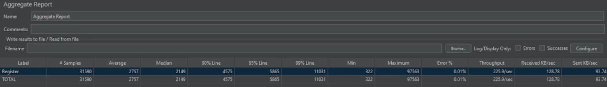
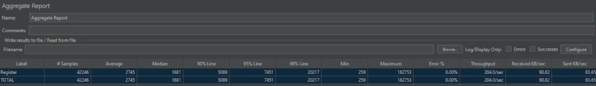

# Pruebas de Carga

Este directorio contiene pruebas de carga para el proyecto. Las pruebas de carga se utilizan para evaluar el rendimiento
del sistema bajo una carga específica. Las pruebas de carga están escritas en archivos `.jmx` y pueden ejecutarse
utilizando JMeter.

## Ejecución de Pruebas de Carga

Para ejecutar las pruebas de carga, necesitas tener JMeter instalado en tu máquina. Puedes descargar JMeter desde
el [sitio oficial](https://jmeter.apache.org/download_jmeter.cgi).

### Ejecución de Pruebas de Carga en Modo No GUI

Para ejecutar las pruebas de carga en modo no GUI, puedes usar el siguiente comando:

```bash
jmeter -n -t <ruta-al-archivo-jmx> -l <ruta-al-archivo-de-resultados>
```

Por ejemplo, para ejecutar el archivo sample.jmx en modo no GUI, puedes usar el siguiente comando:

```bash
jmeter -n -t sample.jmx -l results.jtl
```

Esto ejecutará la prueba de carga y guardará los resultados en el archivo results.jtl.

## Escenario de prueba

Las pruebas de carga están diseñadas para simular una carga específica en el sistema. El contexto de la prueba de carga
incluye lo siguiente:

- Número de usuarios: El número de usuarios virtuales que serán simulados durante la prueba.
- Período de aumento: El tiempo necesario para aumentar el número de usuarios al nivel especificado.
- Cantidad de ciclos: La cantidad de veces que la prueba debe repetirse.
- Duración: La duración de la prueba en segundos.

**En esta prueba de carga, estamos simulando una carga de 1000 usuarios registrándose en SportApp.**

Se manejó un período de rampup de 15 segundos, cantidad de ciclos infinita y una duración de 600 segundos. Este
escenario simula una carga de 1000 usuarios concurrentes hasta un máximo de 9 minutos y 45 segundos.

## Resultados de la prueba

Todo el escenario se ejecutó en una máquina local con las siguientes especificaciones:

- Procesador: Intel Core i7-8700K CPU @ 3.70GHz
- Memoria: 64 GB
- Sistema Operativo: Windows 11
- Versión de JMeter: 5.6.3

El proceso de ejecución fue documentado en formato de video y puede
encontrarse [aquí](https://drive.google.com/file/d/1o-TImU0fJep55t37dAEZB_1rrpbncUJZ/view?usp=sharing)

Los microservicios del proyecto fueron inicialmente escritos en Python. Del diseño experimental del ciclo anterior
encontramos cuál era el número de instancias en ECS (Elastic Container Service) que podía manejar la carga de 1000
usuarios. El número de instancias fue 5. En un análisis de costos, no es eficiente tener 5 instancias funcionando todo
el tiempo, por lo que decidimos encontrar una manera de reducir el número de instancias. Decidimos reescribir los
microservicios en Node.js, ya que es más eficiente en términos de uso de memoria y rendimiento en un contexto de
servidor web. La misma prueba de carga se ejecutó en los microservicios Node.js y los resultados se compararon con los
microservicios Python a continuación.

### Microservicio Python

Se observó que el microservicio Python manejaba la carga de 1000 usuarios con 5 instancias en ECS. Sin embargo, el
costo de mantener 5 instancias en ECS todo el tiempo no era eficiente.

En un tiempo de 2 minutos y 19 segundos, se enviaron 42246 solicitudes HTTP. De estas solicitudes:

- 31587 registros fueron exitosos (constatado en Base de Datos) y 3 registros fallaron (99.99% de éxito)
- El tiempo promedio de respuesta fue de 2.76 segundos.
- El throughput fue de 225.9 solicitudes por segundo, alcanzando un máximo de 331 solicitudes por segundo.



### Microservicio Node.js

Se observó que el microservicio Node.js manejaba la carga de 1000 usuarios con solo 2 instancias en ECS. El rendimiento
del microservicio Node.js fue similar al microservicio Python, pero con un 60% menos de instancias en ECS.

En un tiempo de 3 minutos y 26 segundos, se enviaron 31590 solicitudes HTTP. De estas solicitudes:

- 42246 registros fueron exitosos (constatado en Base de Datos) con un 100% de éxito.
- El tiempo promedio de respuesta fue de 2.74 segundos.
- El throughput fue de 204 solicitudes por segundo, alcanzando un máximo de 342 solicitudes por segundo.



## Análisis de resultados

- El microservicio Node.js es más eficiente en términos de uso de memoria y rendimiento en un contexto de servidor web.
- El microservicio Node.js manejó la carga de 1000 usuarios con solo 2 instancias en ECS, mientras que el microservicio
  Python necesitaba 5 instancias (60% menos recursos computacionales).
- El rendimiento de ambos microservicios fue similar, manejando una carga de 1000 usuarios con un 99.99% de éxito y un
  tiempo promedio de respuesta de 2.75 segundos.
- El microservicio Node.js es más eficiente en términos de costos, ya que requiere menos instancias en ECS para manejar
  la misma carga de trabajo.
