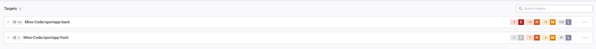
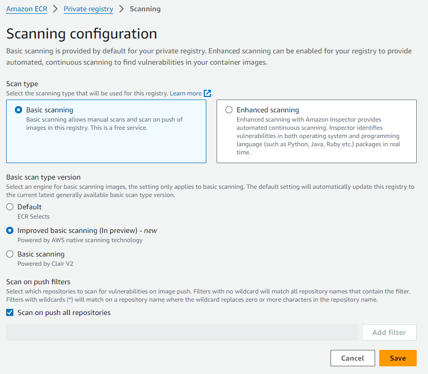
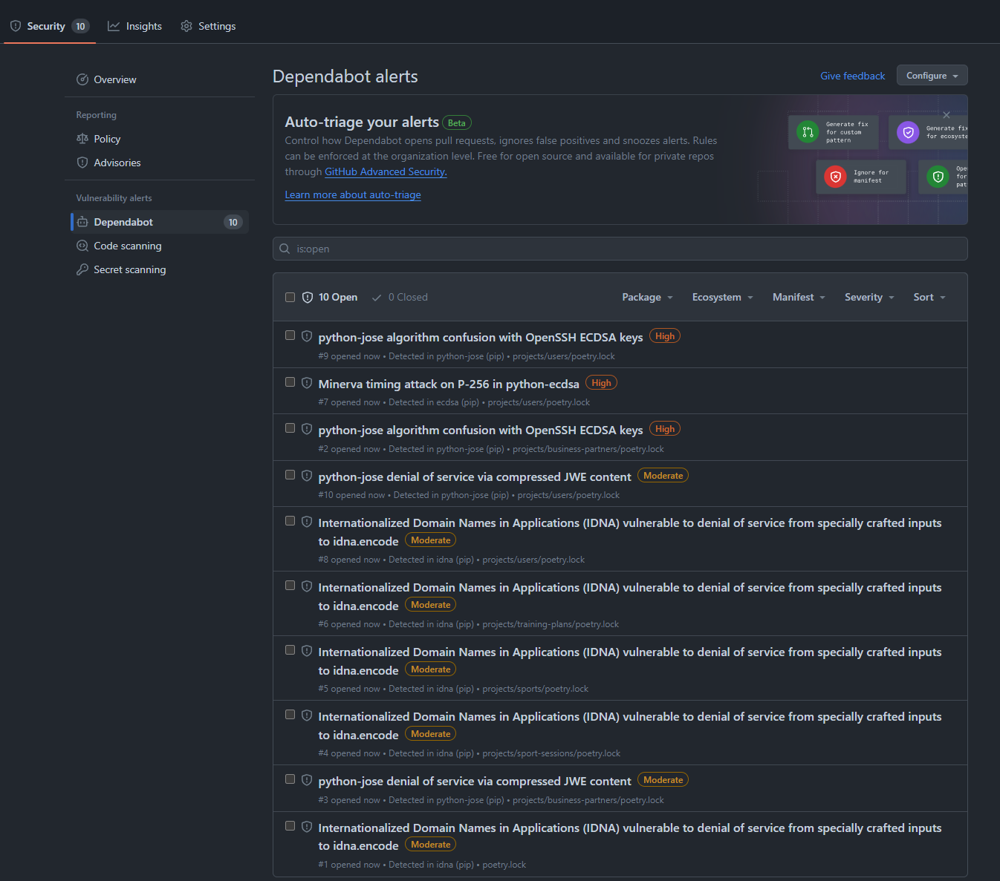
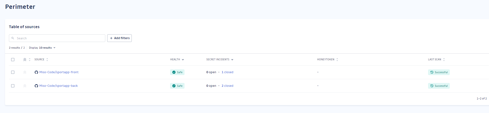
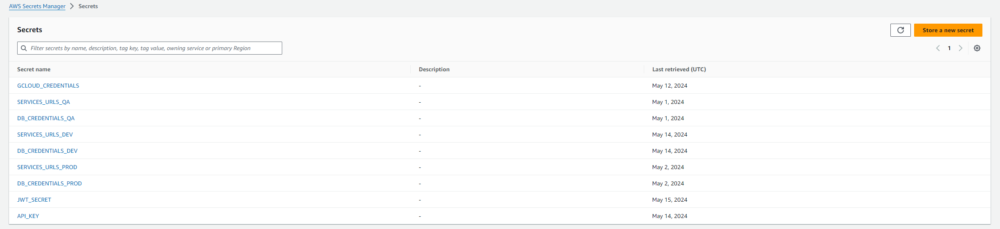
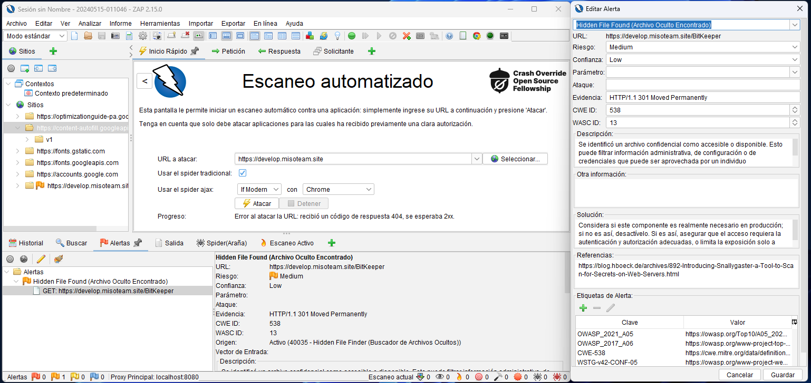
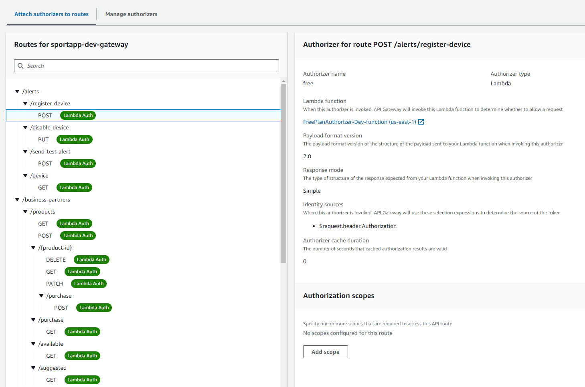

# Pruebas de Seguridad

Este documento describe las pruebas de seguridad que se realizan en el proyecto. Las pruebas involucran el uso de
varias técnicas y herramientas para garantizar que el proyecto sea seguro.

## Índice

- [Pruebas de Seguridad](#pruebas-de-seguridad)
    * [Análisis de Código Estático](#análisis-de-código-estático)
        + [SonarCloud](#sonarcloud)
            - [Adverse Incidents](#adverse-incidents)
            - [Adverse Incidents Provider](#adverse-incidents-provider)
            - [Alerts](#alerts)
            - [Authorizer](#authorizer)
            - [Business Partners](#business-partners)
            - [Miso Stripe](#miso-stripe)
            - [Nutritional Plans](#nutritional-plans)
            - [Sport Events](#sport-events)
            - [Sport Sessions](#sport-sessions)
            - [Sports](#sports)
            - [Training Plans](#training-plans)
            - [Users](#users)
    * [Escaneo de Dependencias](#escaneo-de-dependencias)
        + [Snyk](#snyk)
        + [Clair (AWS ECR)](#clair-aws-ecr)
    * [Actualizaciones de Dependencias](#actualizaciones-de-dependencias)
        + [Dependabot](#dependabot)
        + [Configuración de Dependabot](#configuración-de-dependabot)
    * [Escaneo de Secretos](#escaneo-de-secretos)
        + [GitGuardian](#gitguardian)
    * [Gestión de Secretos](#gestión-de-secretos)
        + [AWS Secrets Manager](#aws-secrets-manager)
    * [Penetration Testing](#penetration-testing)
        + [OWASP ZAP](#owasp-zap)
    * [Protección de acceso a los recursos](#protección-de-acceso-a-los-recursos)
        + [JWT Lambda Authorizer](#jwt-lambda-authorizer)
        + [API Key](#api-key)
    * [Conclusion](#conclusion)

## Análisis de Código Estático

El análisis de código estático es el proceso de analizar el código fuente de un programa sin ejecutarlo. Comprueba
posibles vulnerabilidades de seguridad, malos olores de código y errores en el código. Las herramientas de análisis de
código estático pueden ayudar a identificar vulnerabilidades de seguridad en el código temprano en el proceso de
desarrollo, lo que facilita su corrección antes de que se conviertan en problemas.

### SonarCloud

El análisis de código estático se realiza utilizando SonarCloud. SonarCloud es una herramienta de análisis de código en
la nube que proporciona informes detallados sobre la calidad del código. Comprueba malos olores de código, errores y
vulnerabilidades de seguridad en el código.

Creamos una organización de SonarCloud y la conectamos al repositorio de GitHub. La aplicación de GitHub de SonarCloud
está instalada en el repositorio y analiza automáticamente el código en cada push al repositorio.

A continuación, puedes ver las insignias de SonarCloud para cada proyecto. Mostrará la calificación de seguridad del
proyecto (A, B, C, D o F). Una calificación de seguridad de A es la mejor, mientras que una calificación de seguridad
de F es la peor. La calificación de seguridad se calcula en función del número de vulnerabilidades de seguridad
encontradas en el código.

#### Adverse Incidents

[](https://sonarcloud.io/dashboard?id=misocode_sportapp-back-adverse-incidents)

#### Adverse Incidents Provider

[](https://sonarcloud.io/dashboard?id=misocode_sportapp-back-adverse-incidents-provider)

#### Alerts

[](https://sonarcloud.io/dashboard?id=misocode_sportapp-back-alerts)

#### Authorizer

[](https://sonarcloud.io/dashboard?id=misocode_sportapp-back-authorizer)

#### Business Partners

[](https://sonarcloud.io/dashboard?id=misocode_sportapp-back-business-partners)

#### Miso Stripe

[](https://sonarcloud.io/dashboard?id=misocode_sportapp-back-miso-stripe)

#### Nutritional Plans

[](https://sonarcloud.io/dashboard?id=misocode_sportapp-back-nutritional-plan)

#### Sport Events

[](https://sonarcloud.io/dashboard?id=misocode_sportapp-back-sport-events)

#### Sport Sessions

[](https://sonarcloud.io/dashboard?id=misocode_sportapp-back-sport-sessions)

#### Sports

[](https://sonarcloud.io/dashboard?id=misocode_sportapp-back-sports)

#### Training Plans

[](https://sonarcloud.io/dashboard?id=misocode_sportapp-back-training-plan)

#### Users

[](https://sonarcloud.io/dashboard?id=misocode_sportapp-back-users)

## Escaneo de Dependencias

El escaneo de dependencias es el proceso de analizar las dependencias de un proyecto para identificar vulnerabilidades
de seguridad en las dependencias. Comprueba las vulnerabilidades de seguridad conocidas en las dependencias y
proporciona información sobre cómo corregirlas. Las herramientas de escaneo de dependencias pueden ayudar a identificar
y corregir vulnerabilidades de seguridad en las dependencias temprano en el proceso de desarrollo.

Se suele utilizar para escanear imágenes de Docker, paquetes npm, dependencias de Maven y otros tipos de dependencias.

### Snyk

Snky es una herramienta de escaneo de dependencias que comprueba las vulnerabilidades de seguridad conocidas en las
dependencias de un proyecto. Escanea las dependencias de un proyecto y proporciona información sobre las
vulnerabilidades encontradas en las dependencias.



### Clair (AWS ECR)

Clair es un escáner de vulnerabilidades de código abierto que escanea las imágenes de Docker en busca de
vulnerabilidades de seguridad conocidas. Comprueba las imágenes de Docker almacenadas en ECR de Amazon (ECR) en busca de
vulnerabilidades de seguridad conocidas y proporciona información sobre las vulnerabilidades encontradas en las
imágenes.

Este escaneo está habilitado de forma predeterminada en AWS ECR y se ejecuta automáticamente cuando se empuja una nueva
imagen al ECR.



## Actualizaciones de Dependencias

### Dependabot

Dependabot es una aplicación de GitHub que crea solicitudes de extracción para mantener seguras y actualizadas las
dependencias de un proyecto. Comprueba las actualizaciones de las dependencias todos los días y abre solicitudes de
extracción individuales para cada actualización. Puedes configurar Dependabot para crear solicitudes de extracción para
actualizaciones de un ecosistema de paquetes específico, un directorio o un tipo de paquete.



### Configuración de Dependabot

La configuración de Dependabot se almacena en el archivo `.github/dependabot.yml` en el repositorio. El archivo de
configuración especifica los ecosistemas de paquetes, directorios y horarios para las actualizaciones de dependencias.

```yml
version: 2
updates:
  - package-ecosystem: "github-actions"
    directory: "/"
    schedule:
      interval: "daily"
  - package-ecosystem: "poetry"
    directory: "/projects/adverse-incidents"
    schedule:
      interval: "daily"
    open-pull-requests-limit: 10
    target-branch: "develop"
  - package-ecosystem: "poetry"
    directory: "/projects/adverse-incidents-provider"
    schedule:
      interval: "daily"
    open-pull-requests-limit: 10
    target-branch: "develop"
  - package-ecosystem: "poetry"
    directory: "/projects/alerts"
    schedule:
      interval: "daily"
    open-pull-requests-limit: 10
    target-branch: "develop"
  - package-ecosystem: "poetry"
    directory: "/projects/authorizer"
    schedule:
      interval: "daily"
    open-pull-requests-limit: 10
    target-branch: "develop"
  - package-ecosystem: "poetry"
    directory: "/projects/business-partners"
    schedule:
      interval: "daily"
    open-pull-requests-limit: 10
    target-branch: "develop"
  - package-ecosystem: "npm"
    directory: "/projects/miso-stripe"
    schedule:
      interval: "daily"
    open-pull-requests-limit: 10
    target-branch: "develop"
  - package-ecosystem: "poetry"
    directory: "/projects/nutritional-plans"
    schedule:
      interval: "daily"
    open-pull-requests-limit: 10
    target-branch: "develop"
  - package-ecosystem: "poetry"
    directory: "/projects/sport-events"
    schedule:
      interval: "daily"
    open-pull-requests-limit: 10
    target-branch: "develop"
  - package-ecosystem: "poetry"
    directory: "/projects/sport-sessions"
    schedule:
      interval: "daily"
    open-pull-requests-limit: 10
    target-branch: "develop"
  - package-ecosystem: "poetry"
    directory: "/projects/sports"
    schedule:
      interval: "daily"
    open-pull-requests-limit: 10
    target-branch: "develop"
  - package-ecosystem: "poetry"
    directory: "/projects/training-plans"
    schedule:
      interval: "daily"
    open-pull-requests-limit: 10
    target-branch: "develop"
  - package-ecosystem: "poetry"
    directory: "/projects/users"
    schedule:
      interval: "daily"
    open-pull-requests-limit: 10
    target-branch: "develop"

```

## Escaneo de Secretos

El escaneo de secretos es el proceso de escanear el código fuente en busca de secretos como claves de API, contraseñas
y otra información sensible. Comprueba los secretos en el código fuente y proporciona información sobre los secretos
encontrados en el código.

### GitGuardian

GitGuardian es una herramienta de escaneo de secretos que escanea el código fuente en busca de secretos como claves de
API, contraseñas y otra información sensible. Comprueba los secretos en el código fuente y proporciona información sobre
los secretos encontrados en el código.



## Gestión de Secretos

La gestión de secretos es el proceso de almacenar y gestionar secretos como claves de API, contraseñas y otra
información sensible. Los secretos se almacenan de forma segura y se acceden de forma segura mediante la autenticación y
la autorización.

### AWS Secrets Manager

AWS Secrets Manager es un servicio de gestión de secretos que almacena y gestiona de forma segura secretos como claves
de API, contraseñas y otra información sensible. Encripta los secretos y los almacena de forma segura en la nube de AWS.
Los secretos se pueden acceder programáticamente utilizando el SDK de AWS o la CLI de AWS.



## Penetration Testing

La prueba de penetración es el proceso de probar la seguridad de un sistema simulando un ataque al sistema. Comprueba
las vulnerabilidades de seguridad en el sistema y proporciona información sobre cómo corregirlas. Las herramientas de
prueba de penetración pueden ayudar a identificar y corregir las vulnerabilidades de seguridad en el sistema antes de
que se conviertan en problemas.

### OWASP ZAP

OWASP ZAP es una herramienta de prueba de penetración que comprueba las vulnerabilidades de seguridad en las
aplicaciones web. Simula un ataque a la aplicación web y comprueba las vulnerabilidades de seguridad como cross-site
scripting (XSS), inyección SQL y otras vulnerabilidades. Proporciona informes detallados sobre las vulnerabilidades de
seguridad encontradas en la aplicación web.



## Protección de acceso a los recursos

### JWT Lambda Authorizer

Todas las peticiónes a los recursos de la aplicación deben ser autorizadas. Esto se logra mediante el uso de
Authorizers de Lambda y tokens JWT. Los Authorizers verifican los tokens JWT y verifican los permisos de las
aplicaciones antes de permitir el acceso a los recursos.

Todo esto se hace a través de la AWS API Gateway, que actúa como una fachada para las aplicaciones y gestiona los
permisos y el control de acceso.



Cada solicitud que no pase el Authorizer será rechazada con una respuesta `401 Unauthorized` con el siguiente cuerpo:

```json
{
  "message": "Unauthorized"
}
```

### API Key

Además de los Authorizers de Lambda, algunos de los servicios que construimios en este proyecto también implementan
API Keys para proteger el acceso a los recursos. Las API Keys son cadenas de texto que se envían en la cabecera de
autorización de las solicitudes HTTP y se utilizan para autenticar y autorizar las solicitudes.

Las API Keys se generan automáticamente para cada recurso y se almacenan de forma segura en AWS Secrets Manager. Las
API Keys se utilizan para proteger el acceso a los recursos y garantizar que solo los usuarios autorizados puedan
acceder a ellos.

## Conclusion

Las pruebas de seguridad descritas en este documento ayudan a garantizar que el proyecto sea seguro. Las pruebas
involucran el uso de varias técnicas y herramientas para identificar y corregir vulnerabilidades de seguridad en el
proyecto. Al realizar estas pruebas regularmente, podemos garantizar que el proyecto sea seguro y que los datos estén
protegidos contra accesos no autorizados.
