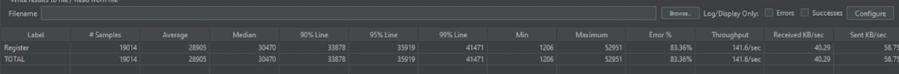

# Pruebas de estrés

Este documento describe las pruebas de estrés realizadas a la aplicación SportApp. Las pruebas de estrés se utilizan
para evaluar el rendimiento del sistema bajo una carga específica. Las pruebas de estrés se escriben en archivos `.jmx`
y se pueden ejecutar utilizando JMeter.

## Ejecución de Pruebas de Estrés

Para ejecutar las pruebas de estrés, necesitas tener JMeter instalado en tu máquina. Puedes descargar JMeter desde
el [sitio oficial](https://jmeter.apache.org/download_jmeter.cgi).

### Ejecución de Pruebas de Estrés en Modo No GUI

Para ejecutar las pruebas de estrés en modo no GUI, puedes usar el siguiente comando:

```bash
jmeter -n -t <ruta-al-archivo-jmx> -l <ruta-al-archivo-de-resultados>
```

Por ejemplo, para ejecutar el archivo sample.jmx en modo no GUI, puedes usar el siguiente comando:

```bash
jmeter -n -t sample.jmx -l results.jtl
```

Esto ejecutará la prueba de estrés y guardará los resultados en el archivo results.jtl.

## Escenario de prueba

Las pruebas de estrés están diseñadas para simular una carga anormal en el sistema. El contexto de la prueba de estrés
incluye lo siguiente:

- Número de usuarios: El número de usuarios virtuales que serán simulados durante la prueba.
- Período de aumento: El tiempo necesario para aumentar el número de usuarios al nivel especificado.
- Cantidad de ciclos: La cantidad de veces que la prueba debe repetirse.
- Duración: La duración de la prueba en segundos.

**En esta prueba de estrés, estamos simulando una carga anormal de 5000 usuarios registrándose en SportApp.**

Este número es 5 veces mayor al número de usuarios que se esperan como máximo en SportApp (probado previamente en las
pruebas de [carga](../load/README.md)). Se manejó un período de rampup de 30 segundos, cantidad de ciclos infinita y una
duración de 600 segundos. Este escenario simula una carga de 5000 usuarios concurrentes hasta un máximo de 9 minutos y
45 segundos.

## Resultados de la prueba

Todo el escenario se ejecutó en una máquina local con las siguientes especificaciones:

- Procesador: Intel Core i7-8700K CPU @ 3.70GHz
- Memoria: 64 GB
- Sistema Operativo: Windows 11
- Versión de JMeter: 5.6.3

Para la practicidad de la prueba, solo se utilizó 1 instancia de los microservicios en ECS (Elastic Container Service).

El proceso de ejecución fue documentado en formato de video y puede
encontrarse [aquí](https://drive.google.com/file/d/1wp9ARpM663g22ZEWeJloTlPDB8GwbnR6/view?usp=sharing)

### Microservicios en Python

### Microservicios en Node.js

## Análisis de resultados

Se presenta el análisis de los resultados obtenidos en las pruebas de estrés desglosado por cada microservicio.

### Microservicios en Python

En el caso de los microservicios en Python, el sistema no pudo manejar la carga de 5000 usuarios. El sistema comenzó a
fallar cuando el número de usuarios virtuales superó los 2000. El tiempo de respuesta aumentó significativamente y el
sistema comenzó a devolver errores 500.

En un tiempo de 2 minutos y 14 segundos, se enviaron 19014 solicitudes HTTP. De estas solicitudes:

- Se presentaron 15850 respuestas fallidas (errores 500 servicio no disponible). Dada la estartegia asíncrona de
  guardado de usuarios en base de datos, se constató con la base de datos y se encontró que se crearon 19006 usuarios.
- El tiempo promedio de respuesta fue de 28.9 segundos
- El throughput fue de 140 solicitudes por segundo.



### Microservicios en Node.js

En el caso de los microservicios en Node.js, el sistema pudo manejar la carga de 5000 usuarios. El tiempo de respuesta
aumentó ligeramente a medida que aumentaba el número de usuarios virtuales, pero el sistema fue capaz de resolver un
porcentaje considerable de solicitudes (alrededor del 80%).

En un tiempo de 1 minuto y 43 segundos, se enviaron 25245 solicitudes HTTP. De estas solicitudes:

- Se presentaron 4116 respuestas fallidas (errores 500 servicio no disponible), pero se constató con la base de datos y
  se encontró que se crearon 21129 usuarios (80% de éxito).
- El tiempo promedio de respuesta fue de 18 segundos
- El throughput fue de 245.6 solicitudes por segundo.


## Conclusiones

De acuerdo con los resultados obtenidos, se concluye que los microservicios en Node.js son más eficientes en términos de
rendimiento y uso de memoria que los microservicios en Python. Los microservicios en Node.js pudieron manejar la carga
de 5000 usuarios con solo 1 instancia en ECS, mientras que los microservicios en Python fallaron con 1 instancia en ECS.

Los microservicios en Node.js presentaron un 80% de éxito en la creación de usuarios, mientras que los microservicios en
Python presentaron un 16.7% de éxito en las respuestas HTTP pero un 99.7% de éxito en la creación de usuarios en la base
dada la estrategia asíncrona de guardado en base de datos.

En términos de costos, los microservicios en Node.js son más eficientes, ya que requieren menos instancias en ECS para
manejar la misma carga de trabajo.
